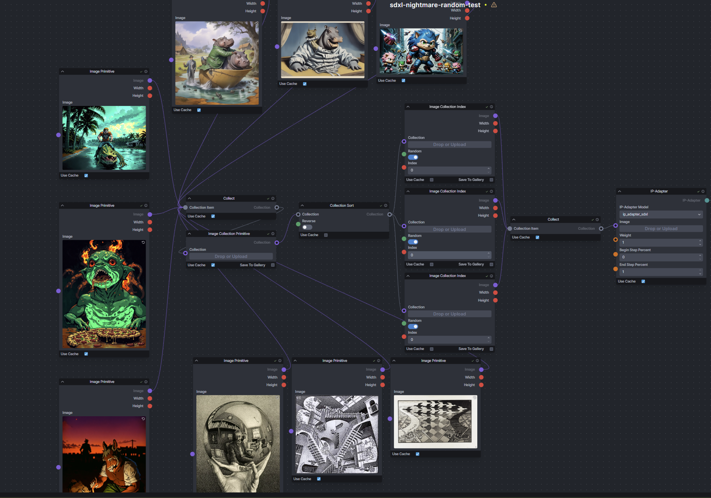

# `collection_tools` for InvokeAI (v4.0+)
Discord Link :- [collection_tools](https://discord.com/channels/1020123559063990373/1216759622007001139)

A set of InvokeAI nodes to manipulate Collections in Invoke AI workflows.

Note: These are currently very experimental, especially the generic versions.

- `Collection Sort` - Generic Collection Sort
- `Collection Index` - Generic Item from a collection via index or random
- `Image Collection Index` - Image from a collection of Images via index or random
- `String Collection Index` - String from a collection of Strings via index or random
- `Integer Collection Index` - Integer from a collection of Integers via index or random
- `Float Collection Index` - Float from a collection of Floats via index or random
- `Bool Collection Index` - Bool from a collection of Bools via index or random
- `LoRA Collection Primitive` - Allows casting of LoRA collections so it can be passed to an iterate node
- `Collection Join` -  Joins two collections into one. it performs no checks so be careful. 

Extension nodes of base collection primitive nodes - these allow creating collections without using a collect node. This enables them to be used with a loop of an `iterate` node without collecting everything from all the iterations.
- `Boolean Collection Primitive Linked`
- `Conditioning Collection Primitive Linked`
- `Float Collection Primitive Linked`
- `Image Collection Primitive Linked`
- `Integer Collection Primitive Linked`
- `Latents Collection Primitive Linked`
- `String Collection Primitive Linked`
- `LoRA Collection Primitive Linked`

## Usage
### <ins>Install</ins><BR>
There are two options to install the nodes:

1. **Recommended**: Git clone into the `invokeai/nodes` directory. This allows updating via `git pull`.

    - In the InvokeAI nodes folder, run:
    ```bash
    git clone https://github.com/skunkworxdark/collection_tools.git
    ```

2. Manually download [collection_tools.py](collection_tools.py) & [__init__.py](__init__.py) then place them in a subfolder under `invokeai/nodes`. 

### <ins>Update</ins><BR>
Run a `git pull` from the `collection_tools` folder.

Or run `update.bat`(windows) or `update.sh`(Linux).

For manual installs, download and replace the files.

### <ins>Remove</ins><BR>
Delete the `collection_tools` folder. Or rename it to `_collection_tools`` so InvokeAI will ignore it.

## Useful Notes

- In the same way that a `collect` node cannot connect directly to an `iterate` node. The same is true for the `Collection Sort` and `Collection Index` nodes.  I would recommend adding a collection/item primitive type node before/after the generic versions of the nodes if they are going to be used with another node with generic types.

## ToDo
- Add more collection data type
- Add more ways to manipulate collections
- Add more example workflows

# Example Usage
Here is an example of selecting 3 random images to add to an IP-Adapter.  You don't need the `Collection Sort` node in this for it to work I just added it to show how it could fit in a workflow.


